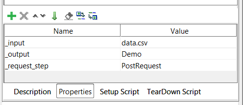

= qReport
Lily Hopkins <lily@hpkns.uk>
v1.0, 2022-09-01
:toc:

== Introduction

qReport loads test cases from a CSV file, runs them, then produces a report of which test cases pass and fail. It is versatile, and can be used for any test cases against any API endpoint, with any kind of protocol, whether REST, SOAP, or something more proprietary.

qReport only works within https://www.soapui.org/[SoapUI^]

== Usage

This assumes you already have a SoapUI project with endpoints configured.

. Create a Test Case in SoapUI to house the Groovy script and request steps.
. Copy the qReport script into a Groovy test step. You can name this anything convenient.
. Create your test cases in a CSV. The CSV must meet the requirements below. An example is provided at the end of this README.
  - a row of headings
  - a column with the heading "ID"
. Create a request within your TestCase for the script to trigger. Disable it so that it does not run, except when triggered by the script.
. Configure this request as your test case, but where you wish for substitutions to occur from the input csv, enter `${#TestCase#heading}`, where `heading` is the name of the heading in the CSV file, for example, it could be: `${#TestCase#date}`. Make sure you add any assertions you need to verify test case success.
. On the Test Case itself, add the required properties, which are explained in more detail below.
+
 
. Run the Groovy script. An HTML report should be generated with details about the passes and fails in the test cases.

IMPORTANT: Running the test case will result in a failure! You must run this from the script itself.

=== Setting Required Properties

Only three properties are required:

|===
|*Property* |*Purpose*
|_input |The name of the input csv file, relative to the directory the current project is saved in.
|_output |The base name of the output file. The date and time of report generation will be appended automatically.
|_request_step |The name of the SoapUI step used to make requests.
|===

TIP: _request_step doesn't need to be provided if the input CSV contains a _request_step column and *every* test case specifies a step.

=== Example CSV

.data.csv
----
ID,itemid,value
TC1 Create,item1,A
TC2 Create,item2,B
TC3 Create,item3,C
----

== Advanced Usage

=== Different Request Steps and Assertions for each Test Case

If you need to run a different request step, perhaps because you need a different HTTP method or assertions, you can actually specify the _request_step as a column in your CSV, for example:

.data_with_request_step.csv
----
ID,_request_step,itemid,value
TC1 Create,PostRequest,item1,A
TC2 Create,PostRequest,item2,B
TC3 Delete,DeleteRequest,item1,
----
